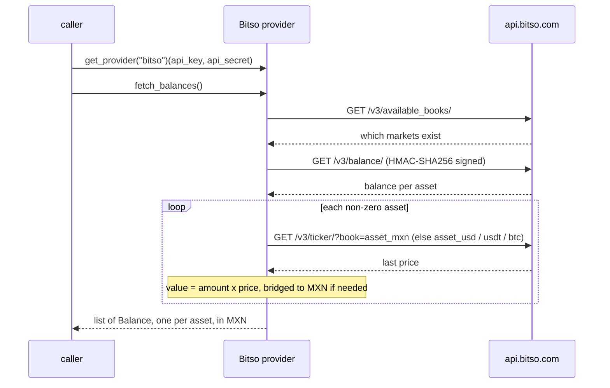

# Bitso — flow

Auth: a read-only API key (`api_key`, `api_secret`). Reads one `Balance` per non-zero asset, valued in
MXN (bridging through USD/USDT/BTC when an asset has no direct MXN market).

```mermaid
sequenceDiagram
  participant C as caller
  participant P as Bitso provider
  participant A as api.bitso.com

  C->>P: get_provider("bitso")(api_key, api_secret)
  C->>P: fetch_balances()
  P->>A: GET /v3/available_books/
  A-->>P: which markets exist
  P->>A: GET /v3/balance/  (HMAC-SHA256 signed)
  A-->>P: balance per asset
  loop each non-zero asset
    P->>A: GET /v3/ticker/?book=asset_mxn (else asset_usd / usdt / btc)
    A-->>P: last price
    Note over P: value = amount x price, bridged to MXN if needed
  end
  P-->>C: list of Balance, one per asset, in MXN
```
